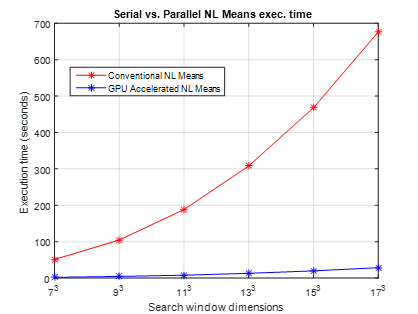

# GPU Acclerated Non Local means (CUDA)

This project was completed as a part of the [CS5234 Advanced Parallel Computing](https://www.cs.vt.edu/graduate/courses/CS5234) course at Virginia Tech.<br/>
In this project, a GPU accelerated version of [Non Local Means](Non%20Local%20Means%20Paper.pdf) is developed.

The project was developed using Nvidia CUDA framework, C++ and Matlab.

## Prerequisites

1. Nvidia GPU (Compute capability ≥ 5.0)
2. Matlab 2015a or above (image preprocessing)
3. Visual Studio 2017 (for building and running the experiments)
4. Windows 10 (The source code is compatible with windows 10)
5. Nsight Visual Studio Plugin

## Graphs and visualizations

<strong>Visualizing the 51 slices of the 3D MR Image</strong><br/><br/>

<br/><hr/>
<strong>CPU vs. GPU execution time</strong><br/><br/>

<br/>

## Building the project and getting started.

These instructions will help you get the project up and running in your local system. 
Please make sure that the aforementioned prerequisites are fulfilled.

1. First go to your [ProjectFiles](ProjectFiles) directory
	- Inside the folder, run the script [data_transform.m](ProjectFiles/data_transform.m) in Matlab.
	- The script will read the [ms_lesions.mat](ProjectFiles/ms_lesions.m) files and add Gaussian White Noise
	- This script will generate [input.bin](ProjectFiles/input.bin] binary file.
	- The generated binary file will be parsed by C++ and CUDA code

2. Next, import the [NLM_Cuda](NLM_Cuda) project in your Visual Studio IDE 
	- Open the [host_code.cpp](NLM_Cuda/NLM_Cuda/host_code.cpp) file.
	- Change the path variable in the file to the exact location of your ProjectFiles directory
	- By default, these standard command line arguments have been loaded in your VS project

```
		f	:	local window Radius 	(local window dims - (2*f + 1) ^ 3)
		t	:	search window Radius	(search window dims - (2*t + 1) ^ 3)
		s	:	standard deviation of the Gaussian kernel
		h	:	standard deviation of the Gaussian Weighting function
		x	:	x-dimension of image
		y	:	y-dimension of image
		z	:	z-dimension of image
```
	
3. Finally for building the project, follow these steps
	- If you haven't already, please disable the Windows [Timeout Detection & Recovery (TDR)](http://developer.download.nvidia.com/NsightVisualStudio/2.2/Documentation/UserGuide/HTML/Content/Timeout_Detection_Recovery.htm)
	- Without this, Windows OS will shutdown kernel operating for more than 2 seconds.
	- In your visual studio project, go to build > rebuild project
	- If your build is successful, Run the project using Debug > Run without Debugging option

4. If you have made it so far, this is the final step
	- When the execution of your code is complete, Go to your [ProjectFiles](ProjectFiles) directory
	- Inside, you'll see that two new binary files [output_cpu.bin](ProjectFiles/output_cpu.bin) and [output_gpu.bin](ProjectFiles/output_gpu.bin) have been generated.
	- Run the Matlab Script [view_data.m](ProjectFiles/view_data.m)
	- You will be shown the 10th slice of Ground truth, Noisy, <br/>CPU generated denosied image & GPU generated denoised image in order
	
5. For further experiments, you can modify the Matlab scripts in the [ProjectFiles](ProjectFiles) directory
	- Several utility scripts have already been written for your convenience


## Authors

1. Adithya H K Upadhya
  	- [LinkedIn](https://in.linkedin.com/in/adithya-upadhya-2021b582)
  	- [Facebook](https://www.facebook.com/hkuadithya)


## License

This project is licensed under the Apache 2.0 LICENSE - see the [LICENSE.md](LICENSE.md) file for details

## Acknowledgments

The author thank his family and the open source community.
